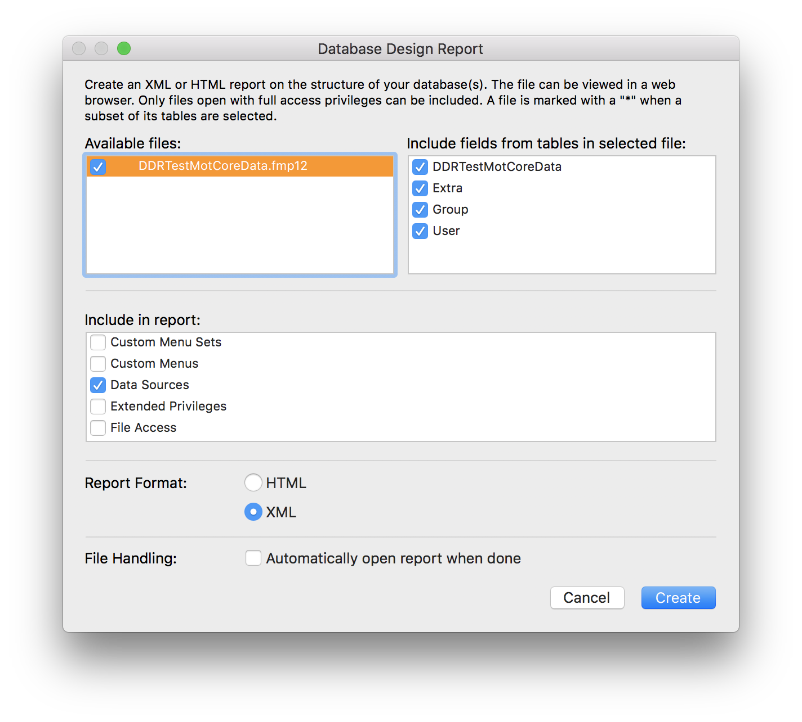
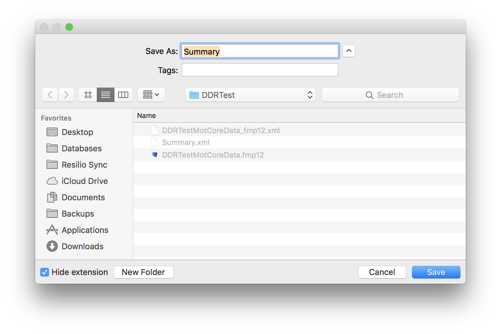
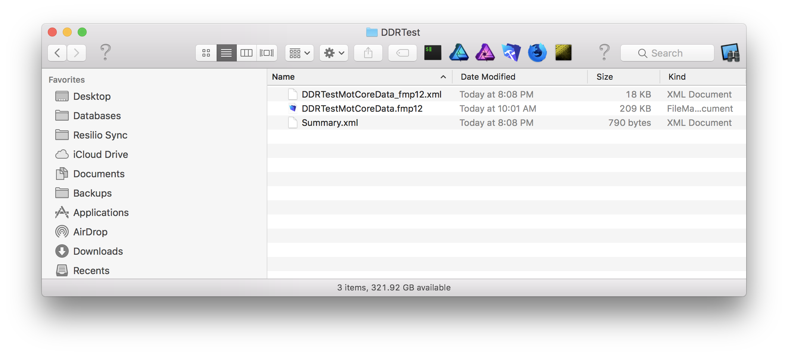

# FMPReport2xcdatamodel
FileMaker Data Design XML Report to CoreData contents-file

Written by Gjermund Gusland Thorsen through years 1999 on, all rights deserved

If you are using an older or newer version of XCode than 8.2.1 you may want to copy/paste the model element from your own CoreData file

How to use this file
---
Create a new XCode project; make sure you have an empty CoreData xcdatamodel in your project

In FileMaker go to the Tools-menu, and ask for a Database Design Report ...
 Database Design Report..." src="ScreenShot1.png" width="100%" max-width=1008>


Make sure you check the radiobutton for (*) for XML



Please close your XCode project before you overwrite the entity file
```bash
$ xsltproc fmpreport2xcdatamodel.xslt DDRTestMotCoreData_fmp12.xml > DDRTestMotCoreData_fmp12.xcdatamodel/contents
```

# FMPReport2xcdatamodel

This piece of tooling gives you the power to convert a FileMaker graph to a CoreData graph by using this xslt as described above. If you use FileMaker as single source of truth AND need native support for data in iOS I have not find any better way to achieve naming conformity throughout the solution.

License
=======

Copyright (c) 1999 on Gjermund Gusland Thorsen, released under the MIT License.

All rights deserved.

Permission is hereby granted, free of charge, to any person obtaining a copy of this software and associated documentation files (the "Software"), to deal in the Software without restriction, including without limitation the rights to use, copy, modify, merge, publish, distribute, sublicense, and/or sell copies of the Software, and to permit persons to whom the Software is furnished to do so, subject to the following conditions:

The above copyright notice and this permission notice shall be included in all copies or substantial portions of the Software.

This piece of software comes with ABSOLUTELY NO WARRANTY, to the extent permitted by applicable law.

